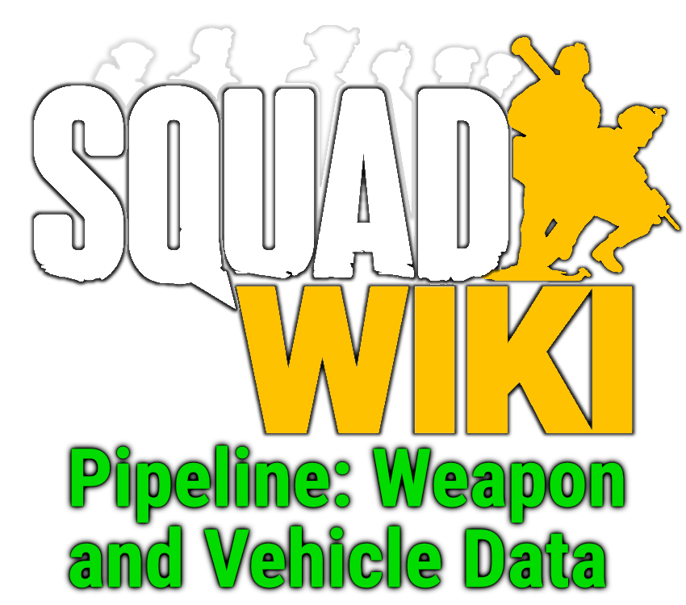

#### Squad Wiki Pipeline: Weapon and Vehicle Data

## About

The **Squad Wiki Pipeline** allows the extraction of game data for the tactical first-person-shooter [Squad](http://store.steampowered.com/app/393380/) by [Offworld Industries](https://www.offworldindustries.com/). The data is extracted from the [Squad SDK](https://squad.gamepedia.com/Squad_SDK) (not the game files!). This sub-pipline focuses on extracting information about the **weapons** and **vehicles** in the game.

Currently only weapon data is extracted, but vehicles is planned to be rolled into this pipeline for simplicty.

## Components
This pipeline currently only consists of one compnent:

1. Exporting game data from the [Squad SDK](https://squad.fandom.com/wiki/Squad_SDK).

## Latest Output Files

You will find output files for all new squad releases in the `data/_currentVersion` folder. Invidual version folders can be also be found in the `data` folder.

A help guide for the output files can be found [here](./doc/weapon.md)

## Usage
### Installation

The latest version of the [Squad SDK](https://squad.fandom.com/Squad_SDK) is required. You will find instructions on how to install the Squad SDK [here](https://squad.fandom.com/Squad_SDK#Downloading_the_Epic_Games_Launcher). Beyond that, simply download the extractor files.

### Configuration

Read about how to configure the pipeline [here](/doc/configuration.md)

### Usage

Read about how to use the extractor [here](/doc/usage.md)

## Contributing

Feel free to use this pipeline or parts of it for other games or game wikis.

If you want to contribute to the pipeline for the [Squad Wiki](https://squad.gamepedia.com/Squad_Wiki), consider joining the team in the [Squad Wiki Editorial](https://squad.gamepedia.com/Squad_Wiki_Editorial).

## Contact

The pipeline was created and is being operated by the team in the [Squad Wiki Editorial](https://squad.gamepedia.com/Squad_Wiki_Editorial) for the [Squad Wiki](https://squad.gamepedia.com/Squad_Wiki). You can best reach us on our own [Discord](https://discord.gg/Y8vgeJ2).

## Authors and Acknowledgment

Listed by Discord user names:

- **shanomac99** - programming and operation

## License

This repository is under the [Creative Commons Attribution-ShareAlike 4.0 International](https://creativecommons.org/licenses/by-sa/4.0/). See [License.md](/license.md).
