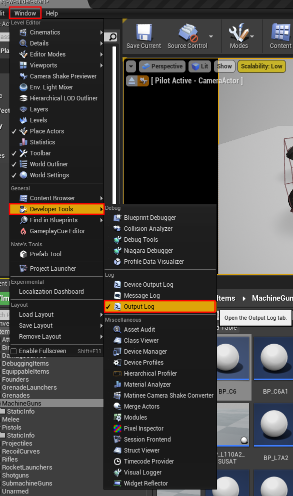
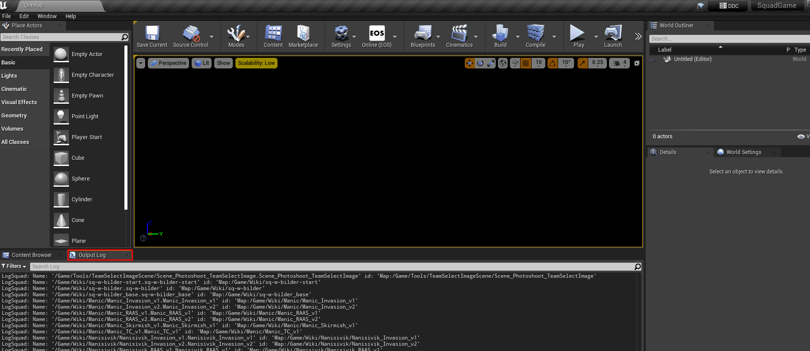
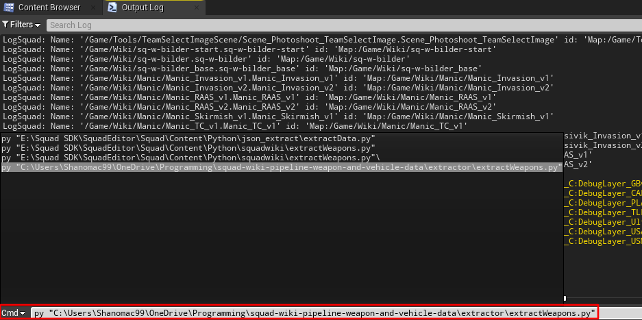

# Using the Pipeline

## Using the Weapon Extractor

To use the weapon extractor first open the SDK, then follow the below steps.

1. Enable the output log. Navigate to `Window` then `Developer Tools` then ensure `Output Log` is ticked.

2. Open the output log.

3. Change the left drop down at the bottom to `Cmd` and type the following command in: `py "location of script"` and hit enter.

The extractor may take 15-20 minutes (depending on your computer it could be more) if it is your first time loading the SDK. The extractor has to load every weapon file, which takes some time in the SDK.

It will then output a `weaponInfo.json` at the location you choose in the [configuration step](/doc/configuration.md).